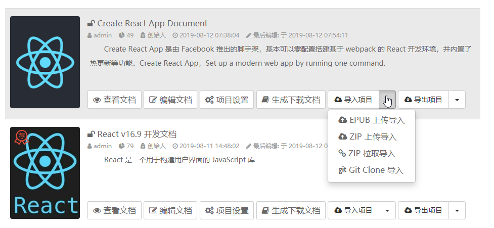
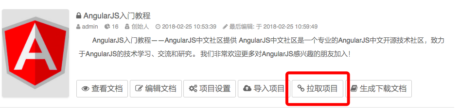
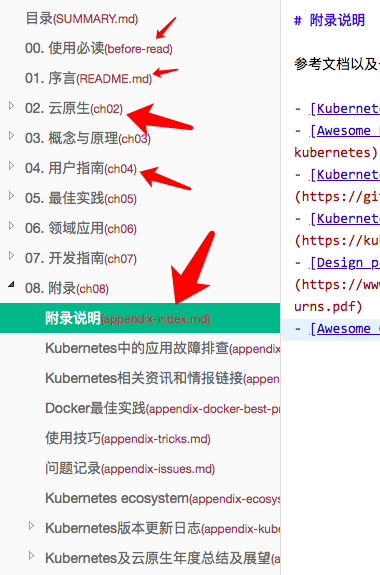
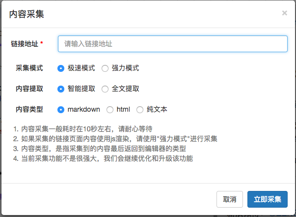
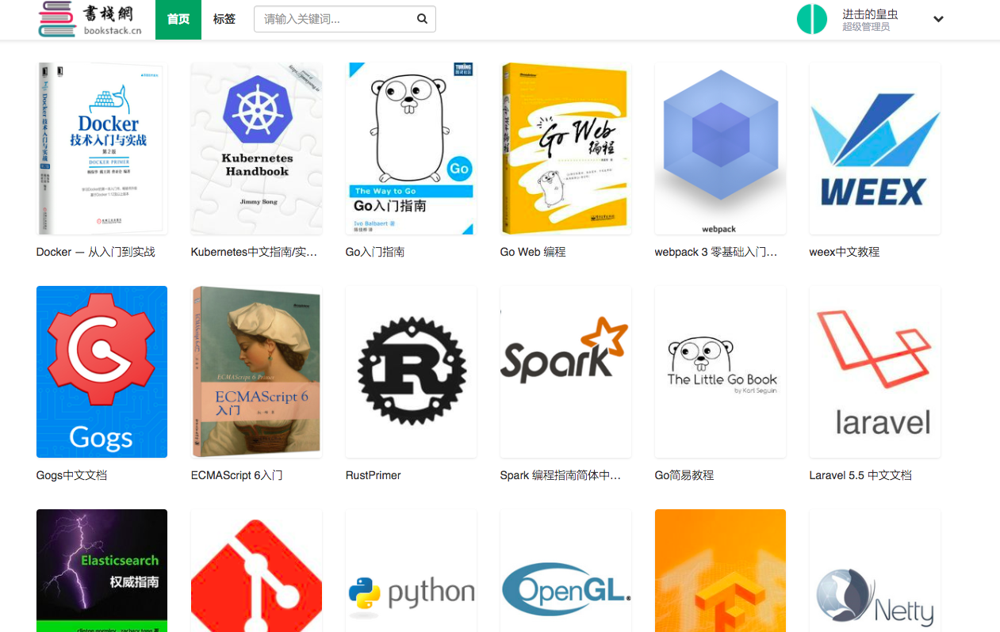
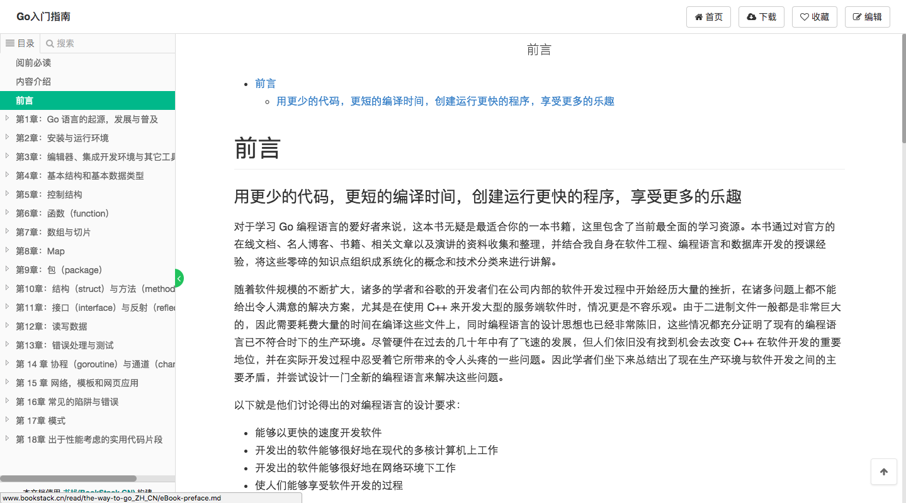
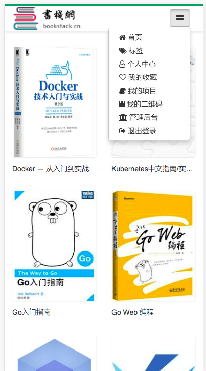

目录：
- [BookStack 简介](#bookstack-简介)
  - [开源](#开源)
  - [QQ交流群](#qq交流群)
  - [站点](#站点)
    - [演示站点](#演示站点)
    - [正式站点](#正式站点)
  - [更新、维护和升级](#更新维护和升级)
  - [数据库变更说明](#数据库变更说明)
  - [功能与亮点](#功能与亮点)
    - [书籍分类(V1.2 +)](#书籍分类v12-)
    - [用户主页(V1.2 +)](#用户主页v12-)
    - [一键导入markdown书籍](#一键导入markdown书籍)
    - [一键拉取markdown书籍](#一键拉取markdown书籍)
    - [生成和导出PDF、epub、mobi等离线文档](#生成和导出pdfepubmobi等离线文档)
    - [文档排序和批量创建文档](#文档排序和批量创建文档)
    - [文档间的跳转](#文档间的跳转)
    - [采集功能](#采集功能)
    - [SEO](#seo)
    - [版本控制](#版本控制)
    - [更美观、简洁的页面布局和更为完善的移动端兼容](#更美观简洁的页面布局和更为完善的移动端兼容)
  - [TODO](#todo)
  - [安装与使用](#安装与使用)
  - [构建与打包](#构建与打包)
  - [关于本人](#关于本人)
  - [赞助我](#赞助我)
    - [支付宝打赏赞助](#支付宝打赏赞助)
    - [微信打赏赞助](#微信打赏赞助)

    

<a name="intro"></a>
# BookStack 简介

BookStack，分享知识，共享智慧！知识，因分享，传承久远！

BookStack是基于[Mindoc](https://github.com/lifei6671/mindoc)开发的，为运营而生。

在开发的过程中，增加和移除了一些东西，目前已经不兼容MinDoc了（毕竟数据表结构、字段、索引都有了一些不同），同时只支持markdown编辑器。

**BookStack 配套手机APP `BookChatApp` 开源地址**

- Gitee: https://gitee.com/truthhun/BookChatApp
- GitHub: https://github.com/TruthHun/BookChatApp

**BookChatApp下载体验地址**

- https://www.bookstack.cn/app

<a name="open"></a>
## 开源
两年前还在做PHP开发的时候，无意间遇到了Gitbook，以及看云，还有readthedoc。

当时想着自己也开发一套，但是后来没时间，当时也没那个技术积累。

后来学了Go语言，又在无意间遇到了[Mindoc](https://github.com/lifei6671/mindoc)，然后我们公司([掘金量化](https://www.myquant.cn) )也恰巧让我开发公司官网和文档系统，然后我就对[Mindoc](https://github.com/lifei6671/mindoc)做了二次开发。

本来是不想开源的，因为自己写代码的时候，写着写着，代码改来改去，然后代码就乱七八糟了，怕开源出来丢人现眼。但是踏入IT行业三年多时间以来，自身也受益于各种开源书籍和开源组件，所以最终还是决定将BookStack开源出来。

其中肯定还是有不足的地方，大家在使用的过程中，遇到问题，欢迎反馈。

源码托管：
- Github: https://github.com/new985211/BookStack-Sqlite
- Gitee: https://gitee.com/truthhun/BookStack

<a name="qqgroup"></a>
## QQ交流群
为方便相互学习和交流，建了个QQ群，加群请备注`来自BookStack`

> QQ交流群：457803862(猿军团)

同时要说明的是，该群是一个学习交流群，如果是程序相关问题，请直接提交issues，不接受邮件求助、微信求助和QQ私信求助

BookStack 安装使用手册：[https://www.bookstack.cn/books/help](https://www.bookstack.cn/books/help)


<a name="site"></a>
## 站点

<a name="demo"></a>
### 演示站点

> 服务器资源有限，不再提供演示站点

<a name="normal"></a>
### 正式站点

**书栈网**：[https://www.bookstack.cn](https://www.bookstack.cn)


<a name="upgrade"></a>
## 更新、维护和升级

- 程序下载与升级日志，看这里--> [Release](https://github.com/new985211/BookStack-Sqlite/releases)

<a name="db"></a>
## 数据库变更说明

本项目原先依赖外部 **MySQL**，安装后需手工建库、配置数据库连接参数。现版本已将数据层迁移为**嵌入式 SQLite**，安装后**无需任何数据库连接配置**，`dpkg -i` 即用。

### 变更内容

- 数据库驱动由 `github.com/go-sql-driver/mysql` 替换为 `modernc.org/sqlite`。
- 数据库文件默认位于程序运行目录下的 `data/bookstack.db`，首次运行时自动创建表结构、初始化管理员账号和演示书籍。
- 删除全部 MySQL 专用代码：`CREATE DATABASE`、`SHOW INDEX`、`ALTER TABLE`、`INSERT IGNORE` 等 DDL，以及 `LIMIT ?,?` 等 MySQL 方言 SQL（统一改为 SQLite 兼容写法）。
- 删除旧的 MySQL 数据迁移脚本（`commands/migrate/migrate_v03.go`）。
- 配置文件中的 `db_host` / `db_port` / `db_username` / `db_password` / `db_database` 等键全部移除，仅保留：

```ini
db_adapter = sqlite3
db_file = data/bookstack.db
```

### 设计考虑

1. **为何用 `modernc.org/sqlite` 而不是 `mattn/go-sqlite3`**
   `mattn/go-sqlite3` 基于 CGO，而本项目的构建脚本使用 `CGO_ENABLED=0` 交叉编译（amd64 / arm64 / macOS / Windows）。纯 Go 实现的 `modernc.org/sqlite` 无 CGO 依赖，可在各平台直接交叉编译，无需额外交叉编译工具链。

2. **为何不迁移存量 MySQL 数据**
   本次改造面向「全新部署、装完即用」的场景。若需保留既有数据，需要额外开发一次性 MySQL → SQLite 导出/导入工具，不属于本次范围。

3. **搜索与 Elasticsearch**
   Elasticsearch 仍是**可选**功能（默认关闭）。未启用 ES 时，全文搜索自动退化为基于 SQLite 的 `LIKE` 模糊查询，功能不受影响。

4. **表前缀保留**
   ORM 表前缀 `md_`（`db_prefix`）保持不变，模型定义无需改动。

5. **配置文件自动生成**
   `conf/app.conf`、`oss.conf`、`oauth.conf` 在首次运行时会自动从对应的 `.example` 模板生成，无需手工复制。

6. **并发写处理**
   SQLite 为单写者数据库，针对阅读计数、收藏、评论等热点写操作，已在连接串中启用 `busy_timeout` 与 WAL 模式以缓解写锁冲突。

<a name="func"></a>
## 功能与亮点

<a name="cate"></a>
### 书籍分类(V1.2 +)
用户就像你的老板，他不知道自己需要什么，但是他知道自己不需要什么...

<a name="homepage"></a>
### 用户主页(V1.2 +)
在用户主页，展示用户分享的书籍、粉丝、关注和手册，增加用户间的互动

<a name="import"></a>
### 一键导入markdown书籍
这个功能，相信是很多人的最爱了。目前这个功能仅对管理员开放。
> 经实测，目前已完美支持各种姿势写作的markdown书籍的文档导入，能很好地处理文档间的链接以及文档中的图片链接



<a name="pull"></a>
### 一键拉取markdown书籍
看到GitHub、Gitee等有很多开源文档的书籍，但是一个一个去拷贝粘贴里面的markdown内容不现实。于是，做了这个一键拉取的功能。
目前只有管理员才有权限拉取，并没有对普通用户开放。要体验这个功能，请用管理员账号登录演示站点体验。
用法很简单，比如我们拉取beego的书籍，在创建书籍后，直接点击"拉取书籍"，粘贴如" https://github.com/beego/beedoc/archive/master.zip "，然后就会自动帮你拉取上面的所有markdown文档并录入数据库，同时图片也会自动帮你更新到OSS。

> 经实测，目前已完美支持各种姿势写作的markdown书籍的拉取，能很好地处理文档间的链接以及文档中的图片链接

> 目前已支持Git Clone导入书籍

<a name="generate"></a>
### 生成和导出PDF、epub、mobi等离线文档
这个需要安装和配置calibre。
我将calibre的使用专门封装成了一个工具，并编译成了二进制，源码、程序和使用说地址：[https://github.com/TruthHun/converter](https://github.com/TruthHun/converter)
在BookStack中，已经引入这个包了。使用的时候，点击"生成下载文档"即可

<a name="sort"></a>
### 文档排序和批量创建文档
很多时候，我们在写作书籍的时候，会习惯地先把书籍的章节目录结构创建出来，然后再慢慢写内容。
但是，书籍中的文档少的时候，一个个去创建倒没什么，但是文档数量多了之后，简直就是虐待自己，排序的时候还要一个一个去拖拽进行排序，很麻烦。现在，这个问题已经解决了。如下：
- 在书籍中，创建一个文档标识为`summary.md`的文档(大小写不敏感)
- 在文档中，填充无序列表的markdown内容，如：

```markdown
<bookstack-summary></bookstack-summary>
* [第0章. 前言]($ch0.md)
* [第1章. 修订记录]($ch1.md)
* [第2章. 如何贡献]($ch2.md)
* [第3章. Docker 简介]($ch3.md)
    * [什么是 Docker]($ch3.1.md)
    * [为什么要用 Docker]($ch3.2.md)
* [第4章. 基本概念]($ch4.md)
    * [镜像]($ch4.1.md)
    * [容器]($ch4.2.md)
    * [仓库]($ch4.3.md)
```
- 然后保存。保存成功之后，程序会帮你创建如"第0章. 前言"，并把文档标识设置为"ch0.md"，同时目录结构还按照你的这个来调整和排序。

注意：
> 必须要有`<bookstack-summary></bookstack-summary>`，这样是为了告诉程序，我这个`summary.md`的文档，是用来创建文档和对文档进行排序的。当然，排序完成之后，当前页面会刷新一遍，并且把`<bookstack-summary></bookstack-summary>`移除了。有时候，第一次排序并没有排序成功，再添加一次这个标签，程序会自动帮你再排序一次。
> 我自己也常用这种方式批量创建文档以及批量修改文档的标题


<a name="redirect"></a>
### 文档间的跳转
你在一个书籍中会有很多文档，其中一个文档的文档标识叫`readme.md`,另外一个文档的文档标识叫`quickstart.md`，两个文档间如何跳转呢？
如果你知道站点的路由规则，倒是可以轻松链过去，但是，每次都要这样写，真的很麻烦。自己也经常写文档，简直受够了，然后想到了一个办法。如下：
我从`readme.md`跳转到`quickstart.md`，在`readme.md`中的内容这样写:
``` 
[快速开始]($quickstart.md)
```
如果跳转到`quickstart.md`的某个锚点呢？那就像下面这样写：
``` 
[快速开始-步骤三]($quickstart.md#step3)
```
好了，在发布文档的时候，文档就会根据路由规则以及你的文档标识去生成链接了(由于是后端去处理，所以在编辑文档的时候，前端展示的预览内容，暂时是无法跳转的)。
那么，问题就来了，我书籍里面的文档越来越多，我怎么知道我要链接的那个文档的文档标识呢？不用担心，在markdown编辑器的左侧，括号里面的红色文字显示的就是你的文档标识。



<a name="crawl"></a>
### 采集功能
看到一篇很好的文章，但是文章里面有代码段、有图片，手工复制过来，格式全乱了，所以，相信采集功能，会是你需要的。采集功能，在markdown编辑器的功能栏上面，对，就是那个瓢虫图标，就是那个Bug，因为我找不到蜘蛛的图标...

功能见下图，具体体验，请到演示站点体验。




<a name="seo"></a>
### SEO
后台管理，个性化定制你的SEO关键字；并且在SEO管理这里，可以更新站点sitemap（暂时没做程序定时自动更新sitemap）


<a name="version-control"></a>
### 版本控制
`MinDoc`之前本身就有版本控制的，但是版本控制的文档内容全都存在数据库中，如果修改频繁而导致修改历史过多的话，数据库可能会被撑爆。当时没有好的解决办法，所以将该功能移除了。

目前加上该功能，是因为这个功能呼声很高，所以加回来了。但是版本控制的内容不再存储到数据库中，而是以文件的形式存储到本地或者是云存储上。

功能在`管理后台`->`配置管理`中进行开启

<a name="beauty"></a>
### 更美观、简洁的页面布局和更为完善的移动端兼容
这是个看脸的时代...

> 首页



> 介绍页


> 内容阅读页



> 个人书籍页


> 手机端首页




<a name="todo"></a>
## TODO

当前仍待实现的功能：

- 微博第三方登录
- 收费下载和收费阅读
- 移动端 APP（weex / 原生）
- 桌面端（electron）

> 注：早期 TODO 中列出的签到、广告位与广告管理、积分、Elasticsearch 搜索、Docker 部署、微信小程序 API、版本管理，以及微信 / GitHub / Gitee / QQ 第三方登录等功能均已实现，此处不再列出。

<a name="install"></a>
## 安装与使用

### 方式一：deb 包安装（推荐，免数据库配置）

系统已内置 SQLite，安装 deb 包后无需配置任何数据库即可使用。详细说明见 [docs/deb-install.md](docs/deb-install.md)。

```bash
# 根据机器架构选择对应 deb 包
sudo dpkg -i bookstack_<version>_amd64.deb   # x86_64
sudo dpkg -i bookstack_<version>_arm64.deb   # ARM (aarch64)

# 安装脚本会自动初始化数据库并启动服务，访问：
#   http://<服务器IP>:8181
```

离线环境下可使用 `scripts/offline-install.sh` 一键安装：

```bash
sudo bash scripts/offline-install.sh
```

### 方式二：源码运行

```bash
# 1. 编译
go build -o BookStack .

# 2. 初始化数据库（自动创建 data/bookstack.db、表结构、管理员账号）
./BookStack install

# 3. 启动（默认监听 8181 端口）
./BookStack
```

### 默认管理员账号

- 账号：`admin`
- 密码：`admin888`

登录后请尽快在 `设置` -> `密码` 中修改默认密码。

### 配置说明

首次运行会自动从 `conf/app.conf.example` 生成 `conf/app.conf`，从 `oss.conf.example` / `oauth.conf.example` 生成对应的配置文件。常用配置项：

```ini
db_adapter = sqlite3                # 数据库适配器（固定）
db_file = data/bookstack.db         # SQLite 数据库文件路径
httpport = 8181                     # 监听端口
runmode = prod                      # 运行模式：dev / prod
store_type = local                  # 存储类型：local / oss
```

有两个模板文件，需要按需修改：

- `/views/widgets/pdf_footer.html` 导出 PDF 文档时，pdf 的 footer 显示内容
- `/views/document/tpl_statement.html` 修改成你想要的文案内容或者删除该文件。如果保留该文件，必须要有 `h1` 标签，因为程序要提取你的 `h1` 标签用于导出文档的目录生成

> 生成 PDF / epub / mobi 离线文档需安装并配置 [calibre](https://github.com/TruthHun/converter)；Markdown 预览渲染需 Chrome（headless）或 puppeteer。

关于二次开发，请看这个issue [README.md中能否添源码编译说明](https://github.com/new985211/BookStack-Sqlite/issues/3)

<a name="build"></a>
## 构建与打包

```bash
# 交叉编译并打包 deb（amd64 + arm64），同时产出 macOS / Windows 可执行文件
bash build.sh <version>
# 例如：bash build.sh 2.0
# 产物位于 output/<version>/ 目录：
#   - bookstack_<version>_amd64.deb
#   - bookstack_<version>_arm64.deb
#   - linux_amd64/ linux_arm64/ mac/ windows/ 下的可执行文件
```

构建脚本使用 `CGO_ENABLED=0` 进行纯静态交叉编译（得益于纯 Go 的 SQLite 驱动），并注入版本号、GitHash、构建时间等元信息。

<a name="aboutme"></a>
## 关于本人
2014年7月本科"毕业"踏入IT行业；Web全栈工程师；什么都懂一点，什么都不精通。


<a name="support"></a>
## 赞助我
如果我的努力值得你的肯定，请赞助我，让我在开源的路上，做更好，走更远。
赞助我的方式包括：`支付宝打赏`、`微信打赏`、`给BookStack一个star`、`向我反馈意见和建议`


<a name="alipay"></a>
### 支付宝打赏赞助


<a name="wxpay"></a>
### 微信打赏赞助

